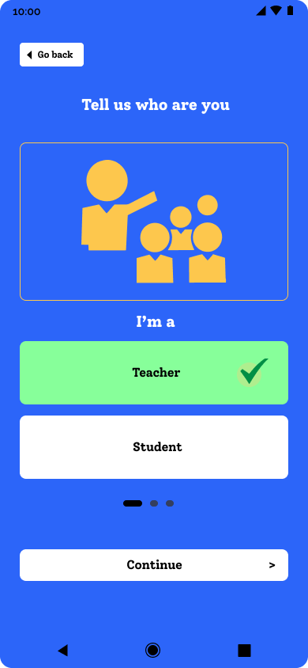
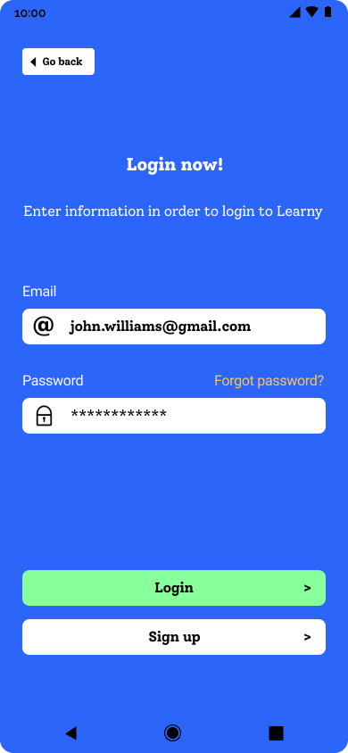

# Learny

[React Native](https://reactnative.dev) courses app.

[Figma link](https://www.figma.com/file/tj3yGEXxXTFbcNWczlm5Du/Learny?t=4fX5eodTb2DbELhL-1)

Appliaction features / uses: 
- eslint-plugin-react
- eslint-plugin-react-native
- React Router
- SVG support (react-native-svg + react-native-svg-transformer)
- custom fonts
- forms (react-hook-form), form validation (yup)

